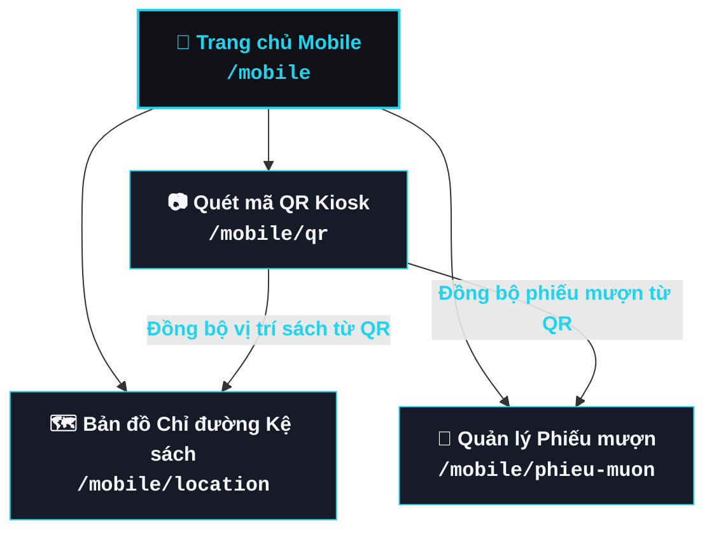

# Cấu trúc Điều hướng Giao diện Mobile Companion (Mobile Navigation Structure)

> **Phân hệ:** Ứng dụng di động đồng hành (Mobile Companion Surface)  
> **Tuyến đường cơ sở (Base Route):** `/mobile/*`  
> **Sơ đồ HTML tương quan:** [`navigation_structure.html`](file:///d:/KHTN_Nam_3/HK3_HCI/Project/HCI_Project/report/diagramdrawing/navigation_structure.html)  
> **Thư mục wireframe gốc:** `figma/mobile/`

---

## I. Tổng quan Kiến trúc Điều hướng Mobile

Giao diện Mobile được thiết kế gọn nhẹ, tập trung vào trải nghiệm đồng hành của sinh viên khi di chuyển trong không gian thư viện và theo dõi cá nhân. Kiến trúc gồm **1 Trang chủ trung tâm** kết nối tới **3 tính năng cốt lõi**:

1. **Quét mã QR từ Kiosk** (Scan QR to Sync Data)
2. **Bản đồ Định vị Kệ sách 2D** (Turn-by-Turn Indoor Shelf Navigation)
3. **Quản lý Phiếu mượn & Hạn trả** (Loan Slips & Return Reminders)

---

## II. Sơ đồ Điều hướng Mobile (Mermaid Diagram)

---

## III. Chi tiết các Tuyến đường (Route Breakdown)

### 1. Trang chủ Mobile (`/mobile`)
* **File Component:** [`MobileHomePage.tsx`](file:///d:/KHTN_Nam_3/HK3_HCI/Project/HCI_Project/code/src/mobile/HomePage.tsx)
* **Wireframe Figma:** `Phone-home-screen.png` (`mobile-home-39-286.png`)
* **Mô tả:** Màn hình chính chứa thông tin cá nhân sinh viên, các nút lối tắt dịch vụ nhanh (Quét QR, Xem vị trí kệ, Phiếu mượn hiện có).

---

### 2. Luồng Quét mã QR Kiosk (`/mobile/qr`)
* **File Component:** [`QrPage.tsx`](file:///d:/KHTN_Nam_3/HK3_HCI/Project/HCI_Project/code/src/mobile/QrPage.tsx)
* **Wireframe Figma:** `Phone-QR.png` (`mobile-qr-41-598.png`)
* **Chức năng:** Mở camera quét mã QR được tạo và hiển thị trên màn hình Kiosk. 
  * Khi quét QR sách: Tự động tải bản đồ vị trí kệ sách sang màn hình `LocationPage`.
  * Khi quét QR mượn: Lưu thông tin phiếu mượn sang màn hình `LoanSlipsPage`.

---

### 3. Luồng Bản đồ Định vị Kệ sách (`/mobile/location`)
* **File Component:** [`LocationPage.tsx`](file:///d:/KHTN_Nam_3/HK3_HCI/Project/HCI_Project/code/src/mobile/LocationPage.tsx)
* **Wireframe Figma:** `Phone-Location.png` (`mobile-location-41-630.png`) & `MapView_inPhoneLocation.png`
* **Chức năng:** Hiển thị sơ đồ mặt bằng thư viện 2D tương tác. Cho biết vị trí thực tế của sinh viên và vẽ tuyến đường ngắn nhất (turn-by-turn) dẫn thẳng tới dãy kệ chứa cuốn sách cần tìm.

---

### 4. Luồng Quản lý Phiếu mượn (`/mobile/phieu-muon`)
* **File Component:** [`LoanSlipsPage.tsx`](file:///d:/KHTN_Nam_3/HK3_HCI/Project/HCI_Project/code/src/mobile/LoanSlipsPage.tsx)
* **Wireframe Figma:** `Phone-PhieuMuon.png` (`mobile-phieu-muon-49-122.png`)
* **Chức năng:** Quản lý toàn bộ danh sách các sách đang mượn, hiển thị thời hạn trả sách (Due Date), các cảnh báo sắp hết hạn hoặc quá hạn mượn, và lịch sử các đợt mượn sách trước đó.

---

## IV. Tài nguyên Liên quan
* 🎨 **Bản vẽ Visual HTML:** [`navigation_structure.html`](file:///d:/KHTN_Nam_3/HK3_HCI/Project/HCI_Project/report/diagramdrawing/navigation_structure.html)
* 🖥️ **Tài liệu Navigation Kiosk:** [`kiosk_navigation.md`](file:///d:/KHTN_Nam_3/HK3_HCI/Project/HCI_Project/report/diagramdrawing/kiosk_navigation.md)
