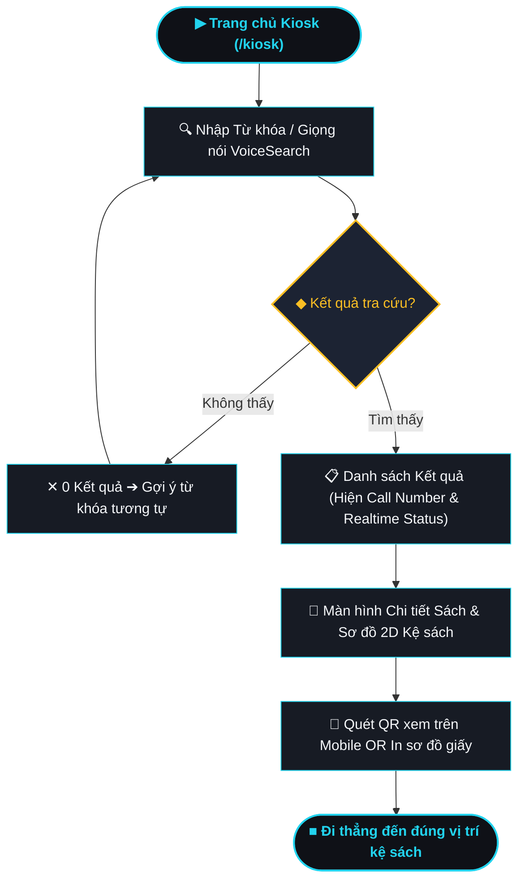
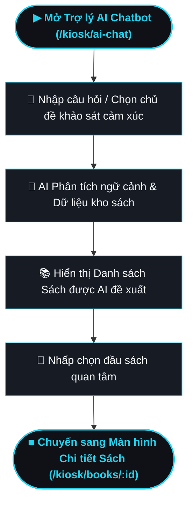
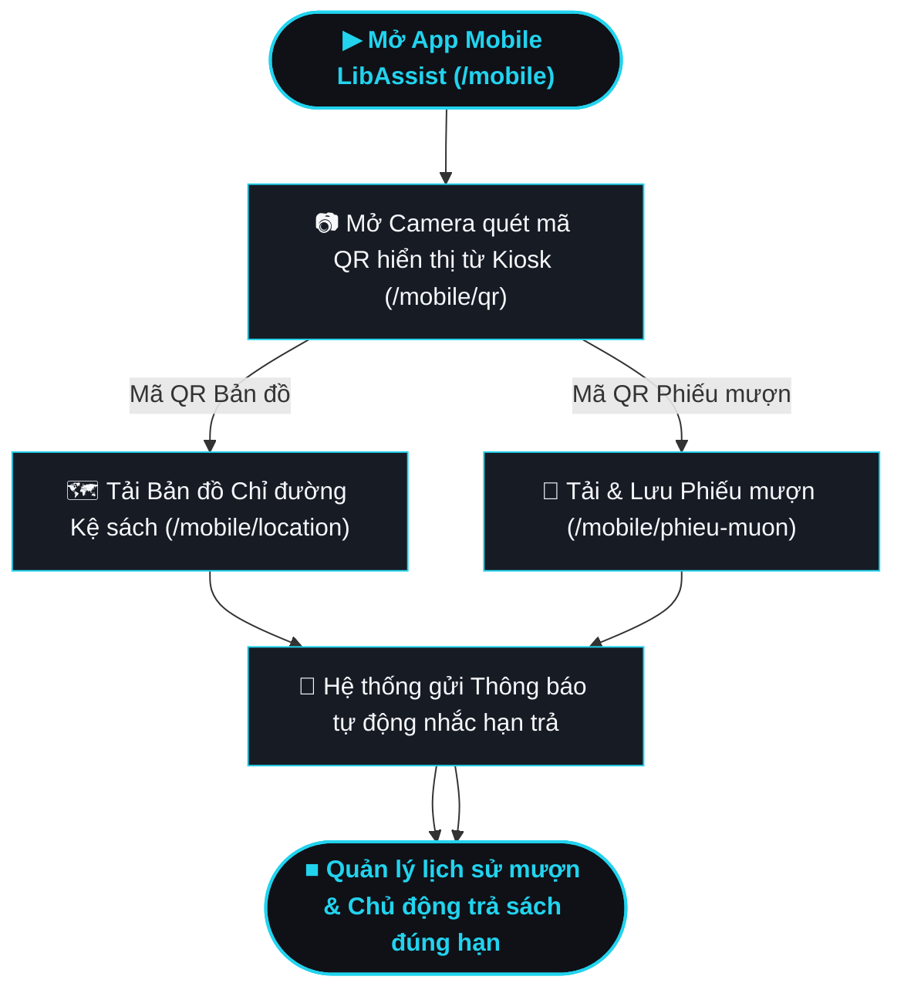

# 5.2. Các Luồng Người dùng Quan trọng (User Flows) — LibAssist

> **Phân hệ:** Hệ thống Hỗ trợ Tìm kiếm & Mượn sách Thông minh LibAssist  
> **Sơ đồ HTML tương quan:** [`user_flows.html`](file:///d:/KHTN_Nam_3/HK3_HCI/Project/HCI_Project/report/diagramdrawing/user_flows.html)  
> **Bản vẽ liên quan:** [`navigation_structure.html`](file:///d:/KHTN_Nam_3/HK3_HCI/Project/HCI_Project/report/diagramdrawing/navigation_structure.html)

---

## I. Tổng quan về các Luồng Người dùng (User Flow Overview)

Trong hệ thống **LibAssist**, quy trình đọc và mượn sách được tối ưu hóa để loại bỏ hoàn toàn các điểm nghẽn truyền thống (như xếp hàng tại quầy thủ thư, bế tắc khi tìm vị trí kệ, hay nhập liệu khắt khe). 

Hệ thống tập trung vào **4 luồng người dùng quan trọng (Key User Flows)**:

1. **Luồng 1: Tra cứu Sách & Định vị Kệ sách 2D (Book Search & Indoor Location Flow)**
2. **Luồng 2: Trò chuyện & Gợi ý Sách thông minh qua AI (AI Recommendation Flow)**
3. **Luồng 3: Quy trình Tự Mượn sách tại Kiosk (Self-Checkout Scan Flow)**
4. **Luồng 4: Đồng bộ & Quản lý Phiếu mượn trên Mobile (Mobile Companion Flow)**

---

## II. Chi tiết Các Luồng Người dùng Quan trọng

### 1. Luồng Tra cứu Sách & Định vị Kệ sách 2D (Book Search & Indoor Location Flow)

#### Mô tả luồng:
Người dùng di chuyển đến Kiosk, nhập từ khóa tìm kiếm (hoặc dùng tính năng tìm bằng giọng nói `VoiceSearch`). Hệ thống áp dụng thuật toán **Fuzzy Search** cho phép gõ không dấu, viết tắt. Kết quả hiển thị danh sách sách kèm trạng thái số lượng khả dụng trên kệ theo thời gian thực (realtime). Khi chọn một đầu sách, Kiosk hiển thị sơ đồ mặt bằng 2D chỉ đường trực tiếp tới vị trí kệ. Người dùng có thể quét mã QR để chuyển bản đồ sang điện thoại di động hoặc in sơ đồ giấy tại Kiosk.

#### Sơ đồ Luồng 1 (Mermaid Diagram):


---

### 2. Luồng Trò chuyện & Gợi ý Sách thông minh qua AI (AI Recommendation Flow)

#### Mô tả luồng:
Dành cho người dùng chưa xác định cụ thể tên sách cần tìm. Sinh viên mở tính năng **AI Chatbot** trên Kiosk, trò chuyện trực tiếp hoặc chọn các khảo sát nhanh theo chủ đề/cảm xúc. AI phân tích ngữ cảnh và trả về các gợi ý sách phù hợp nhất trong thư viện. Sinh viên nhấp vào cuốn sách ưng ý để xem thông tin vị trí và tiến hành mượn ngay.

#### Sơ đồ Luồng 2 (Mermaid Diagram):


---

### 3. Luồng Quy trình Tự Mượn sách tại Kiosk (Self-Checkout Scan Flow)

#### Mô tả luồng:
Quy trình tự phục vụ (Self-service) giúp sinh viên mượn sách trong vòng **30 giây** mà không cần xếp hàng quầy thủ thư:
* **Bước 1:** Đưa gáy/mã vạch sách vào đầu đọc mã vạch (Barcode Scanner) trên Kiosk.
* **Bước 2:** Đưa thẻ sinh viên vào vùng quét (RFID / Barcode) để xác thực tài khoản.
* **Kết quả:** Hệ thống khởi tạo phiếu mượn tự động, đồng bộ dữ liệu backend và tự động in phiếu mượn giấy cho sinh viên.

#### Sơ đồ Luồng 3 (Mermaid Diagram):
```mermaid
flowchart TD
    classDef startEnd fill:#0F1117,stroke:#22D3EE,stroke-width:2px,color:#22D3EE,font-weight:bold;
    classDef step fill:#171B24,stroke:#22D3EE,stroke-width:1px,color:#F5F7FA;
    classDef decision fill:#1C2333,stroke:#FBBF24,stroke-width:2px,color:#FBBF24;
    classDef fail fill:rgba(255,107,107,0.12),stroke:#FF6B6B,stroke-width:1px,color:#FF8E8E;

    START(["▶ Chọn Tự mượn sách (/kiosk/scan)"]):::startEnd
    STEP1["📦 Bước 1: Quét Mã vạch Sách (/kiosk/scan/step-1)"]:::step
    DEC1{"◆ Kiểm tra mã sách?"}:::decision
    FAIL1["✕ Mã không đọc được / Lỗi dữ liệu"]:::fail
    STEP2["🪪 Bước 2: Quét Thẻ Sinh viên (/kiosk/scan/step-2)"]:::step
    DEC2{"◆ Kiểm tra thẻ SV?"}:::decision
    FAIL2["✕ Thẻ không hợp lệ / Vi phạm gia hạn"]:::fail
    SUCCESS["✅ Hoàn tất Mượn sách (/kiosk/borrow-complete)"]:::step
    FINISH(["■ In phiếu mượn tự động & Cập nhật hạn trả"]):::startEnd

    START --> STEP1 --> DEC1
    DEC1 -- "Lỗi" --> FAIL1 --> STEP1
    DEC1 -- "Hợp lệ" --> STEP2 --> DEC2
    DEC2 -- "Lỗi" --> FAIL2 --> STEP2
    DEC2 -- "Hợp lệ" --> SUCCESS --> FINISH
```

---

### 4. Luồng Đồng bộ & Quản lý Phiếu mượn trên Mobile (Mobile Companion Flow)

#### Mô tả luồng:
Sinh viên mở ứng dụng di động **LibAssist Mobile Companion**. Sử dụng tính năng quét mã QR để tải sơ đồ dẫn đường 2D (Indoor turn-by-turn navigation) từ Kiosk sang điện thoại hoặc lưu thông tin phiếu mượn. Ứng dụng tự động theo dõi thời hạn trả sách (Due Date) và gửi thông báo nhắc nhở tự động trước khi tới hạn.

#### Sơ đồ Luồng 4 (Mermaid Diagram):


---

## III. Tài nguyên Liên quan
* 🎨 **Bản vẽ HTML Visual User Flows:** [`user_flows.html`](file:///d:/KHTN_Nam_3/HK3_HCI/Project/HCI_Project/report/diagramdrawing/user_flows.html)
* 🖥️ **Tài liệu Navigation Kiosk:** [`kiosk_navigation.md`](file:///d:/KHTN_Nam_3/HK3_HCI/Project/HCI_Project/report/diagramdrawing/kiosk_navigation.md)
* 📱 **Tài liệu Navigation Mobile:** [`mobile_navigation.md`](file:///d:/KHTN_Nam_3/HK3_HCI/Project/HCI_Project/report/diagramdrawing/mobile_navigation.md)
